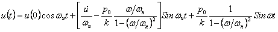

Forced vibration is of two types:  
1. undamped forced vibration 
2. damped forced vibration  
Undamped forced vibration : The differential governing equation for system without damping is mü + ku = posinωt 
where, m = mass; ü = acceleration; k = stiffness; u = displacement; ωn= natural frequency; po= amplitude of force. 
Solution of the given equation is  

 

[Read More](docs/3.Theory.pdf)

